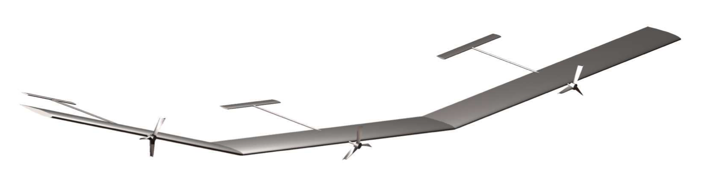

# SimVFA
Adaptive Control of Very-Flexible Aircraft in Simulink

## Description
This package is used to simulate the control of the longitudinal dynamics of a 3-wing very-flexible aircraft (VFA), using MATLAB and Simulink. The required functions for the simulation are encapuslated in the class "SimVFA". The script "RunVFASim" provides the necessary input to instantiate the simulation class, run a simulation, and plot some basic output.

The simulation uses a nonlinear VFA model as the plant, with controllers based on linearizations of the (nominal version of the) model at different dihedral angles. The adaptive controller is designed according to the method described in the paper "*Adaptive Output-Feedback Control for a Class of Multi-Input Multi-Output Plants with Arbitrary Relative Degree*" by Zheng (Max) Qu et al. These simulation files originate with Max's work, but have been continued by Ben Thomsen and other lab members since Max's graduation.

The main steps of the simulation process are:
1. Trim the nominal nonlinear VFA model (without actuator dynamics) at different dihedral angles (find the inputs and states such that states are not changing) and compute linearized state-space representation
2. Introduce uncertainties and actuator dynamics
3. For each trim point:
    1. Augment linearized system with actuator dynamics and integral error for command tracking
    2. Add ficticious inputs to "square-up" the system - to provide SPR properties necessary for adaptive control design
    3. Compute baseline LQR feedback matrix (K), CRM feedback matrix (L), along with ouptut-mixing matrix (S) and transformed coordinates according to method in paper
4. Set initial conditions, choose adaptation rates and related gains for simulation, define command trajectory, and run simulation

With first-order actuator model (*Relative-degree 2*):

**States (x):**

Airspeed [fps], AOA [deg], Pitch Angle [deg], Pitch Rate [deg/s], Dihedral [deg], Dihedral Rate [deg/s], Aileron [deg], Elevator [deg], Dihedral Int Error [ft], Vert Accel Int Error [fps]

With second-order actuator model (*Relative-degree 3*):

**States (x):**

Airspeed [fps], AOA [deg], Pitch Angle [deg], Pitch Rate [deg/s], Dihedral [deg], Dihedral Rate [deg/s], Aileron [deg], Elevator [deg], Aileron Rate [deg/s], Elevator Rate [lbs/s], Dihedral Int Error [ft], Vert Accel Int Error [fps]

**Outputs (y):**

Pitch Rate [deg/s], Dihedral Integral Error [deg.s], Vertical Accel Integral Error [fps]

Goal is for outputs z to track command r (some notation uses z_cmd)

**Regulated Outputs (z):**

Dihedral [deg], Vertical Accel. [fps^2]

**Inputs (u):**

Aileron [deg], Elevator [deg]

The use of this simulation package requires the Control System Toolbox and Simulink Control Design

## References
"*Adaptive Output-Feedback Control for a Class of Multi-Input Multi-Output Plants with Arbitrary Relative Degree*"

"*Adaptive Output-Feedback Control and Applications to Very Flexible Aircraft*" 
(http://hdl.handle.net/1721.1/104223)

"*Modeling for Control of Very Flexible Aircraft*"
(https://doi.org/10.2514/6.2011-6202)

"*Squaring-Up Method in the Presence of Transmission Zeros*"
(https://arxiv.org/abs/1310.1439v2)

"*Robust and Adaptive Control - with Aerospace Applications*"
(https://doi.org/10.1007/978-1-4471-4396-3)
